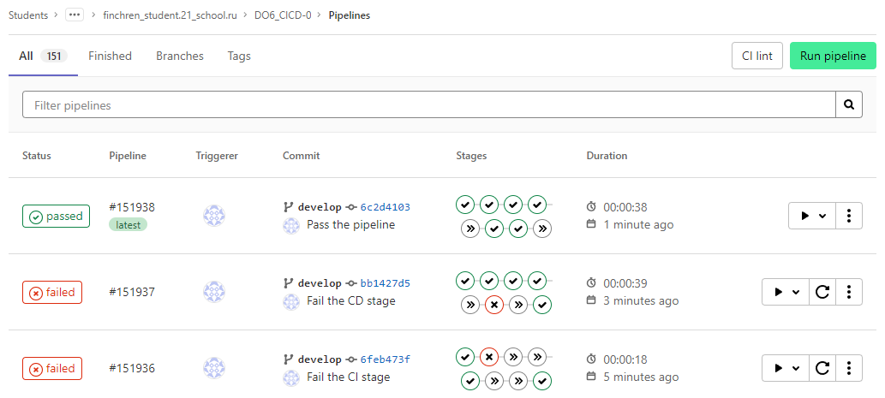

# Report on setting up a Telegram bot to send out the notifications on the status of the pipeline execution

[_From BotFather to 'Hello World'_](https://core.telegram.org/bots/tutorial)\
[_Gitlab's predefined variables reference_](https://docs.gitlab.com/ee/ci/variables/predefined_variables.html)\
[_curl_](https://curl.se/)

**Steps to set up the Telegram bot:**

1. Create bot using @BotFather;
2. Get the token;
3. Get your Telegram user ID to send the message;
4. Contents of the Bash script to send out the message:

_ci_notify.sh:_
```
#!/bin/bash

TIME="10"
URL="https://api.telegram.org/bot$TELEGRAM_BOT_TOKEN/sendMessage"
TEXT="CI stage execution status: $1%0A%0AProject:+$CI_PROJECT_NAME%0AURL:+$CI_PROJECT_URL/pipelines/$CI_PIPELINE_ID/%0ABranch:+$CI_COMMIT_REF_SLUG"

curl -s --max-time $TIME -d "chat_id=$TELEGRAM_USER_ID&disable_web_page_preview=1&text=$TEXT" $URL > /dev/null
```
_cd_notify.sh:_
```
#!/bin/bash

TIME="10"
URL="https://api.telegram.org/bot$TELEGRAM_BOT_TOKEN/sendMessage"
TEXT="CD stage execution status: $1%0A%0AProject:+$CI_PROJECT_NAME%0AURL:+$CI_PROJECT_URL/pipelines/$CI_PIPELINE_ID/%0ABranch:+$CI_COMMIT_REF_SLUG"

curl -s --max-time $TIME -d "chat_id=$TELEGRAM_USER_ID&disable_web_page_preview=1&text=$TEXT" $URL > /dev/null
```

5. Contents of .gitlab-ci.yml file to run the stages and send a Telegram notification based on the result of the pipeline:
```
variables:
  TELEGRAM_BOT_TOKEN: "5832561739:AAHUw8ySKVVq2Bc_orcHuE_ewM1MeY47FMw"
  TELEGRAM_USER_ID: "341749425"

stages:
  - build
  - style-check
  - test
  - ci_notify_success
  - ci_notify_failure
  - deploy
  - cd_notify_success
  - cd_notify_failure

build:
  stage: build
  tags:
    - ws1_cicd
  script:
    - cd src/C3_SimpleBashUtils-0/src/cat/
    - make
    - cd ..
    - cd grep/
    - make
  artifacts:
    paths:
    - src/C3_SimpleBashUtils-0/src/cat/s21_cat
    - src/C3_SimpleBashUtils-0/src/grep/s21_grep
    expire_in: 30 days

style-check:
  stage: style-check
  tags:
    - ws1_cicd
  script:
    - cd src/C3_SimpleBashUtils-0/src/
    - clang-format -n cat/s21_cat.c &>> clang_output.txt
    - clang-format -n cat/s21_cat.h &>> clang_output.txt
    - clang-format -n cat/test_cat.sh &>> clang_output.txt
    - clang-format -n grep/s21_grep.c &>> clang_output.txt
    - clang-format -n grep/s21_grep.h &>> clang_output.txt
    - clang-format -n grep/test_grep.sh &>> clang_output.txt
    - clang-format -n grep/old_test_grep.sh &>> clang_output.txt
    # Uncomment to fail the CI stage
    #- clang-format -n grep/Makefile &>> clang_output.txt
    - bash pipeline_scripts/check_clang_output.sh
    - cat clang_output.txt
  allow_failure: false

test:
  stage: test
  tags:
    - ws1_cicd
  script:
    - cd src/C3_SimpleBashUtils-0/src/cat/
    - make test_cat
    - cd ..
    - cd grep/
    - make test_grep
    - bash ../pipeline_scripts/check_test_results.sh
  allow_failure: false

ci_notify_success:
  stage: ci_notify_success
  tags:
    - ws1_cicd
  script:
  - bash src/06/ci_notify.sh ✅

ci_notify_failure:
  stage: ci_notify_failure
  tags:
    - ws1_cicd
  script:
  - bash src/06/ci_notify.sh ❌
  when: on_failure

deploy:
  stage: deploy
  when: manual
  tags:
    - ws1_cicd
  script:
    - bash src/C3_SimpleBashUtils-0/src/pipeline_scripts/copy_files_to_ws2.sh
    # Uncomment to fail the CD stage
    #- bash src/C3_SimpleBashUtils-0/src/pipeline_scripts/doesnt_exist.sh
  allow_failure: false

cd_notify_success:
  stage: cd_notify_success
  tags:
    - ws1_cicd
  script:
  - bash src/06/cd_notify.sh ✅

cd_notify_failure:
  stage: cd_notify_failure
  tags:
    - ws1_cicd
  script:
  - bash src/06/cd_notify.sh ❌
  when: on_failure
```

_**Tests executed**:_
1. All stages passed successfully.
2. CD stage failed.
3. CI stage failed.


_**Test: Failing the CI stage:**_\


_**Test: Failing the CD stage:**_\


_**Test: Successfully completing all of the stages:**_\

