> All parts of the task should be highlighted in the report as level 2 headers.
> Within one part of the task, everything that is added to the report must be in the form of the list.
> Each screenshot in the report must be briefly captioned (what’s in the screenshot).
> All screenshots must be cropped so that only the relevant part of the screen is shown.

# <h1 align="center">Report on Linux operating systems</h1>

_<h2 align="left"> Part 1. Installation of the OS:</h2>_
_Version of the OS installed: Ubuntu 20.04 Server LTS without GUI_
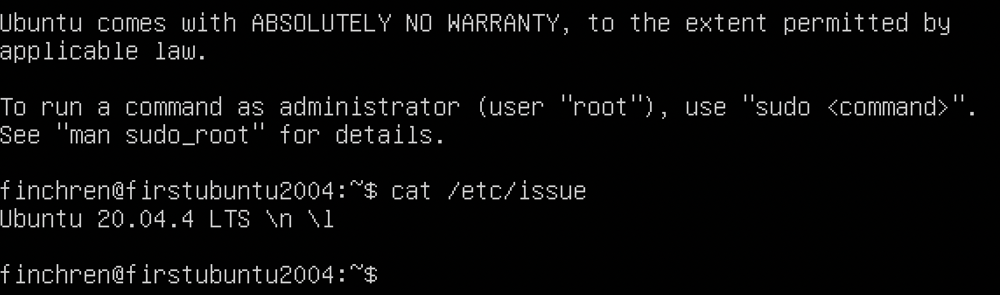

_<h2 align="left"> Part 2. Creating a user:</h2>_
_Add user using sudo adduser <username> command and gave the user admin rights using sudo_
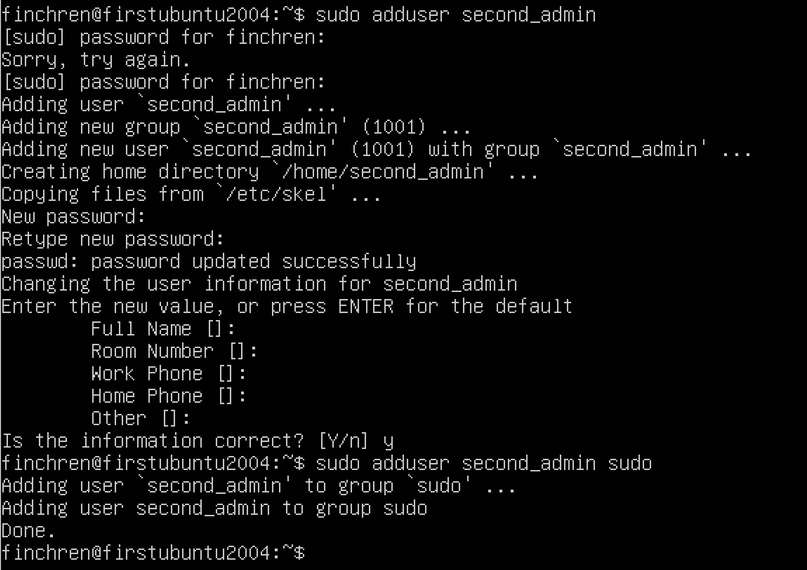
_Result of cat /etc/passwd command output_
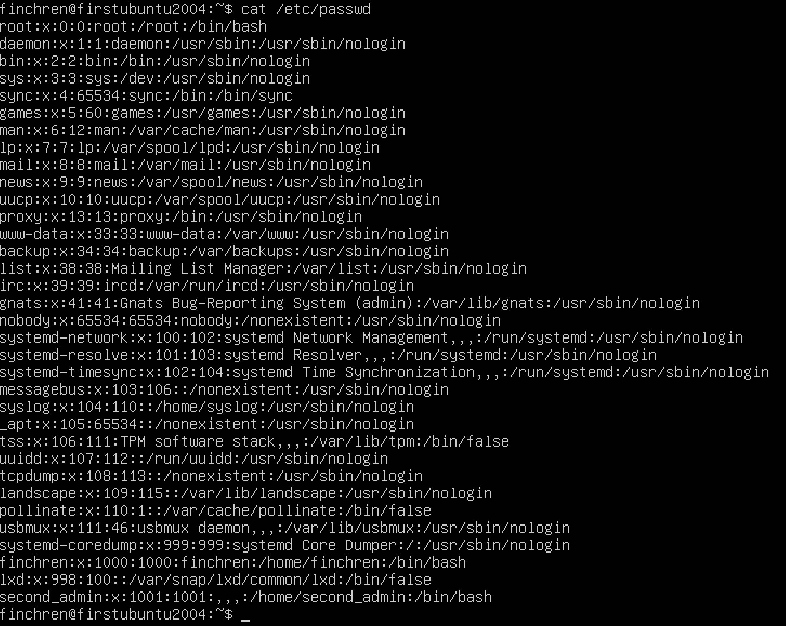

_<h2 align="left"> Part 3. Setting up the OS network:</h2>_

1. Set the machine name as user-1:
    Look up the hostname with hostnamectl:
`$ hostnamectl`
    And edit it using:
`$ hostnamectl set-hostname 'user-1'`

_Result of the hostname look up and hostname change_
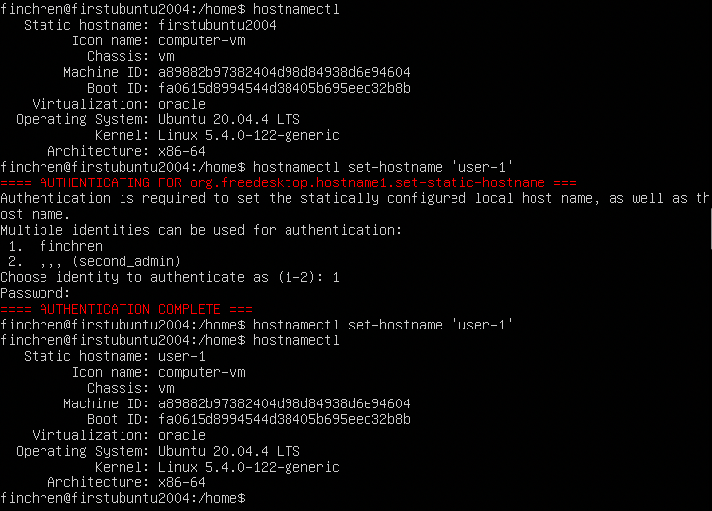

2. Set the time zone corresponding to your current location:
View all available timezones using `$ timedatectl list-timezones`
Set the timezone using `$ sudo timedatectl set-timezone <Etc/GMT+3>`

_Result of the timezone change_
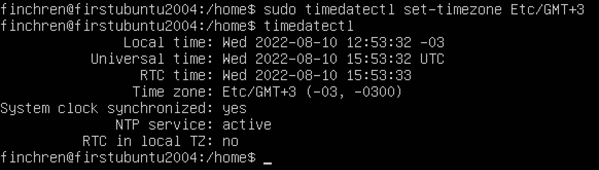

3. Output the names of the network interfaces using a console command:
    To show all available interfaces I need to use `$ ip link show` command

_Show all network interfaces_
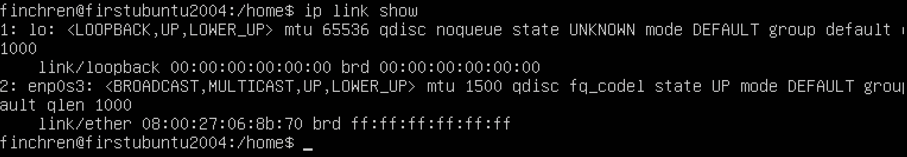
lo – Loopback interface. The loopback network interface is a virtual network device implemented entirely in software. All traffic sent to it "loops back" and just targets services on your local machine. It represents the Linux-host itself. 

4. Use the console command to get the ip address of the device you are working on from the DHCP server:
    To get the IP-address call the command `$ ip r` or `$ ip address` (since I got the IP using DHCP either way)

_The IP is 10.0.2.15_
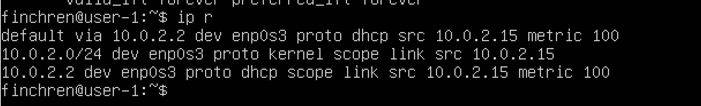
DHCP - Dynamic Host Configuration Protocol.

5. Define and display the external ip address of the gateway (ip) and the internal IP address of the gateway, aka default ip address (gw):    
    To find and display the internal IP of the gateway (default IP) use the following command: `$  ip addr show`

_Internal IP address of the gateway_

    To find the external IP address I need to parse IP-address from a webpage. Wget command can be used for that with flags q and O: `$ wget -qO- eth0.me`

_External IP address of the gateway_
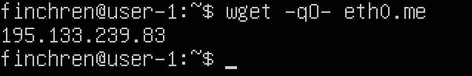

6. Set static (manually set, not received from DHCP server) ip, gw, dns settings (use public DNS servers, e.g. 1.1.1.1 or 8.8.8.8):
    - Open the interfaces file with a text editor and admin rights: `$ sudo nano /etc/network/interfaces`
    
    _Open interfaces to edit_

    - Enter new values:
    
    _Enter new IP, gateway, mask, dns_

    - Edit /etc/resolv.conf: `$ sudo nano /etc/resolv.conf`
    
    _Edit the resolv configuration file_
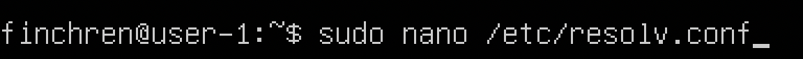

    _Entered the new dns servers_
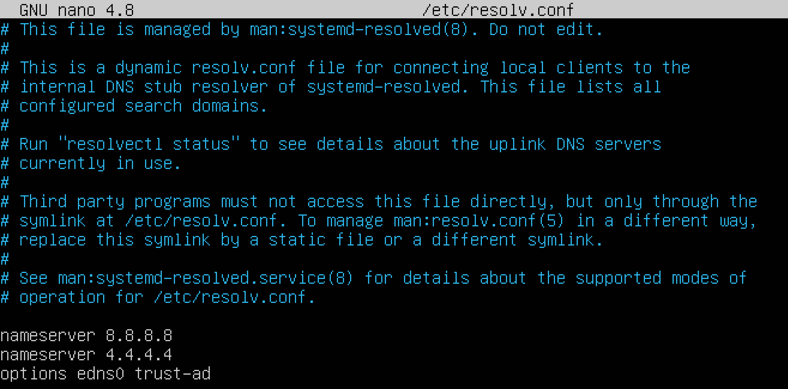

    - Restart the virtual machine using `$ sudo reboot`
    
    _Restarted the network_

    - Ping 1.1.1.1 and ya.ru:

    _Ping_
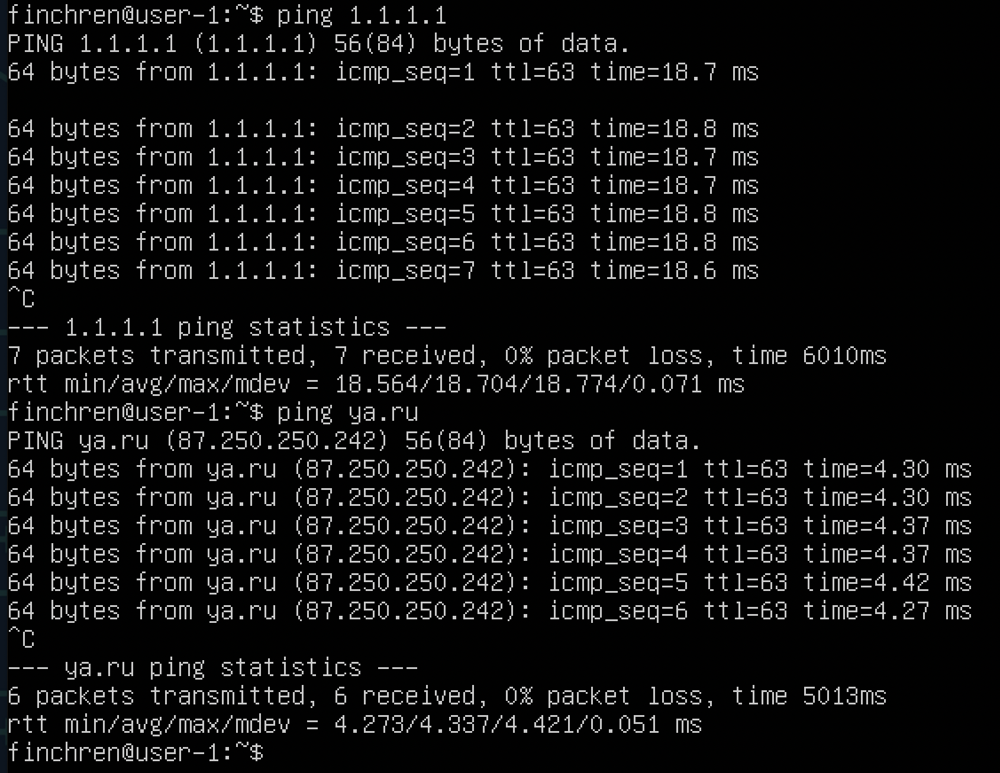

_<h2 align="left"> Part 4. OS Update:</h2>_

`$ apt-get update` and `$ sudo apt-get upgrade`:

    OS update
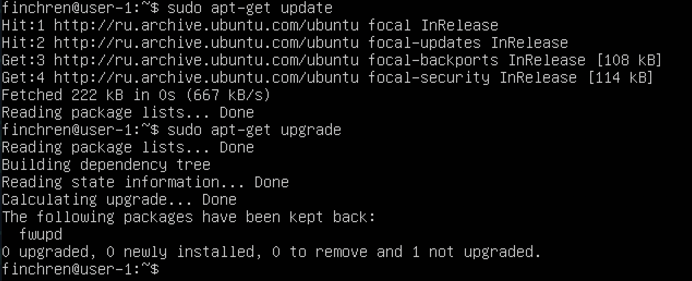

_<h2 align="left"> Part 5. Using the sudo command:</h2>_
_Sudo command grants root power to administrators (members of group admin or sudo) based on the rules defined in /etc/sudoers._

    - `$ sudo usermod -aG sudo second_admin`;
    
    Switch to the second user and change the hostname

    - `$ sudo reboot`;
    
    Hostname changed after the reboot
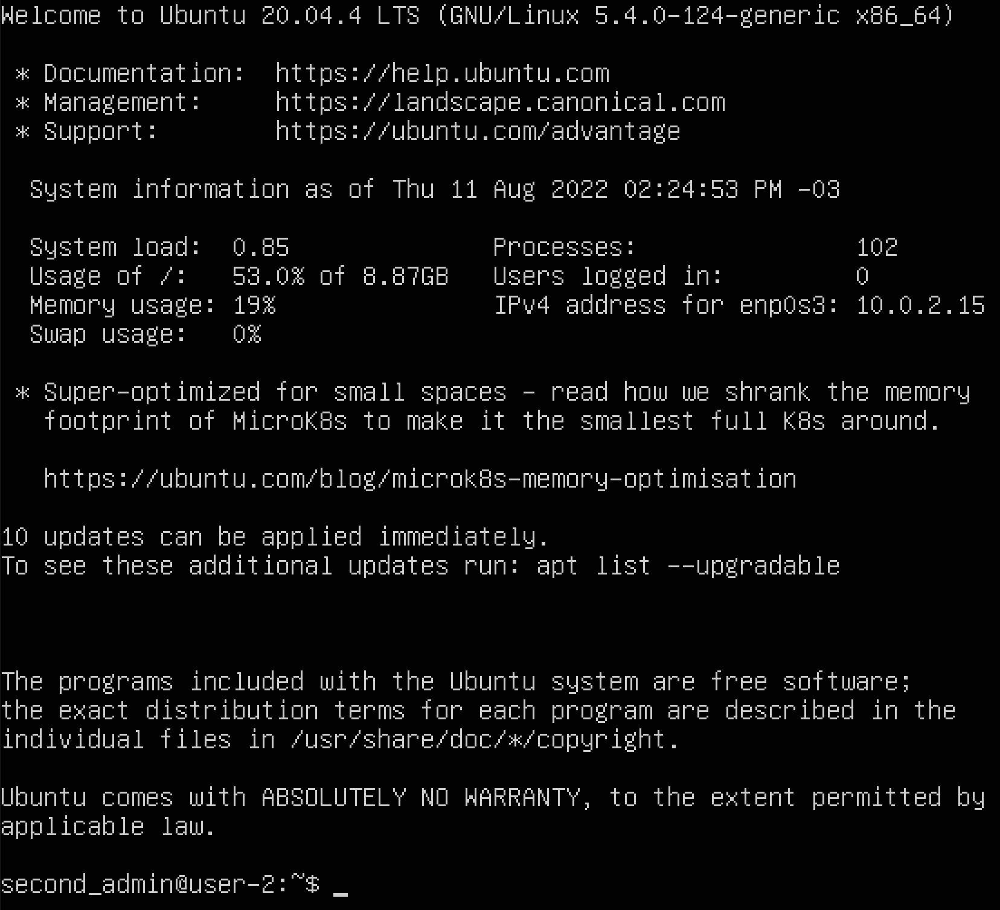

_<h2 align="left"> Part 6. Installing and configuring the time service:</h2>_

    - Install and set up Chrony to synchronize time:

    Synchronized using Chrony
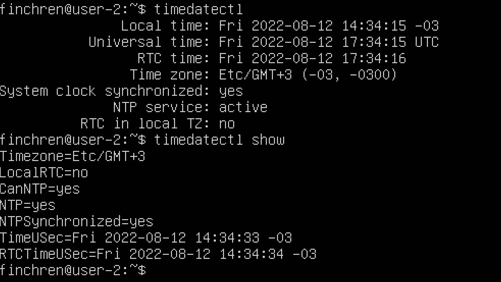
