# Simple Docker report

## Part 1. Ready-made Docker

1. Download the official docker image from nginx using `$ docker pull`:

2. Check for the docker image with `$ docker images`:\
`REPOSITORY   TAG       IMAGE ID       CREATED      SIZE`\
`nginx        latest    3964ce7b8458   6 days ago   142MB`

3. Run docker image `$ docker run -d 3964ce7b8458`:\
`c6a176f8dfb6ebd3d011bf22fdd9f53c00e6531461d18d5c75ff62e1b89e1c18`

4. Check that the image is running: `$ docker ps`:

5. View container information `$ docker inspect c6a176f8dfb6`

Container size: `"SizeRootFs": 141843741`\
List of mapped ports: `"Ports": {"80/tcp": null}`\
Container IP: `"IPAddress": "172.17.0.2"`

6. Stop docker image `$ docker stop`: \
`c6a176f8dfb6`

7. Check that the image has stopped `$ docker ps`:

8. Run docker with mapped ports 80 and 443 on the local machine with run command: `$ docker run -d -p 80:80 -p 443:443 3964ce7b8458`:

9. Check that the nginx start page is available in the browser at localhost:80:

10. Restart docker container `$ docker restart c6a176f8dfb6` and check that the container is running:

## Part 2. Operations with the container

1. Read the nginx.conf configuration file inside the docker container with the exec command `$ docker exec -it <container-id> bash`, `$ cat /etc/nginx/nginx.conf`:
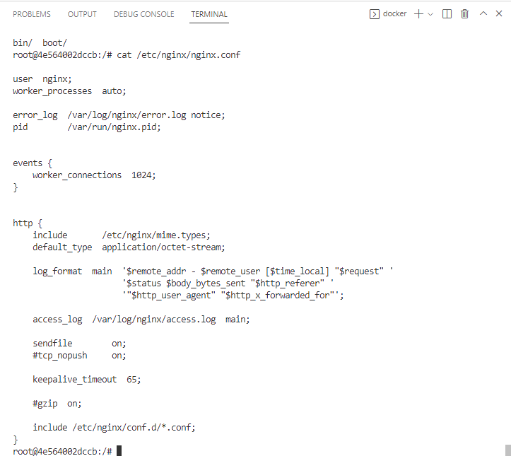

2. Create a nginx.conf file on a local machine: \
`$ touch nginx.conf`
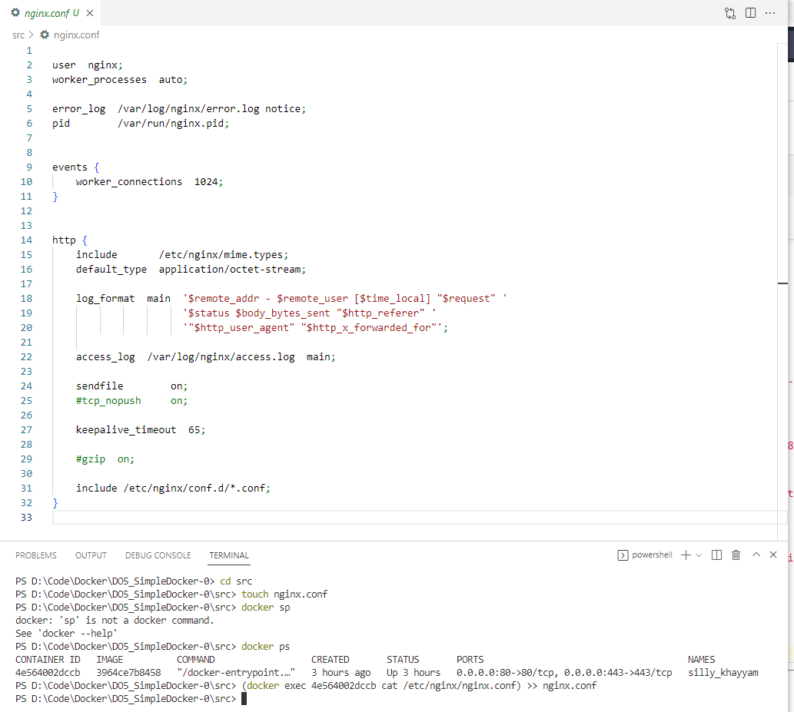

3. Configure it on the /status path to return the nginx server status page:\
_The ngx_http_stub_status_module module provides access to basic status information_
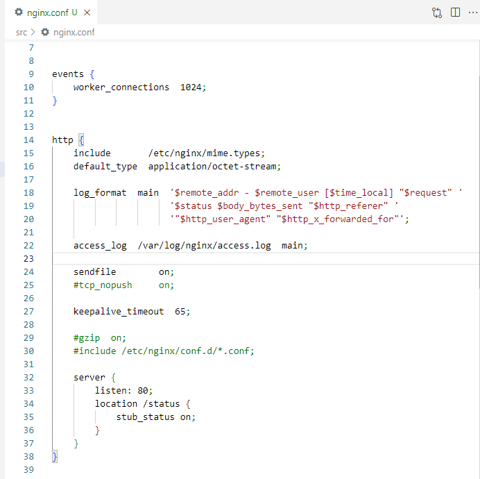

_Line 30 is commented because nginx takes other files of configurations which don't let location '/status' work properly._

4. Copy the created nginx.conf file inside the docker image using the docker cp command `$ docker cp nginx.conf c6e561c366ea:etc/nginx/`:\
_Copied configuration file:_
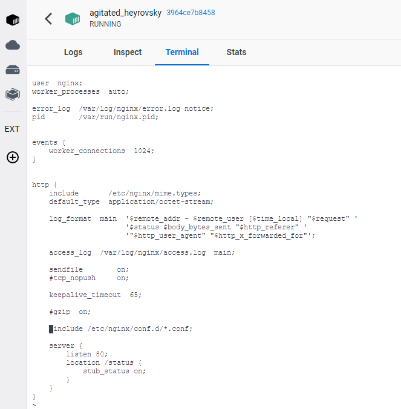

5. Restarted nginx inside the docker image:
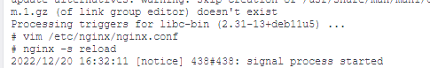

6. Check that localhost:80/status returns the nginx server status page:
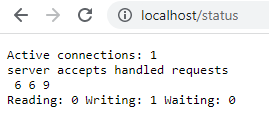

7. Exported the container to a container.tar file with the export command `$ docker export -o container.tar 3ca2d50b57d5`:
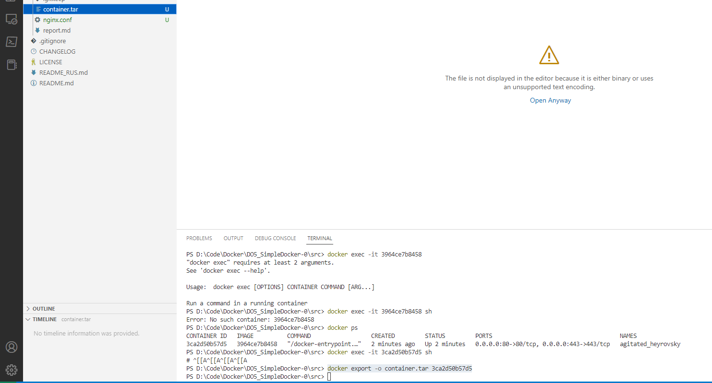

8. Stoped the container `$ docker stop 3ca2d50b57d5`:
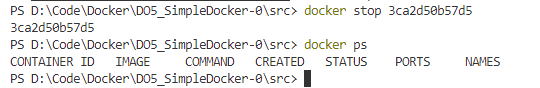

9. Deleted the image with docker rmi [image_id|repository]without removing the container first:
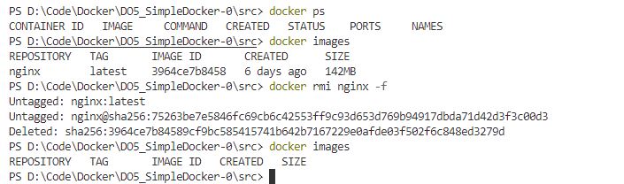

10. Deleted the stopped container:
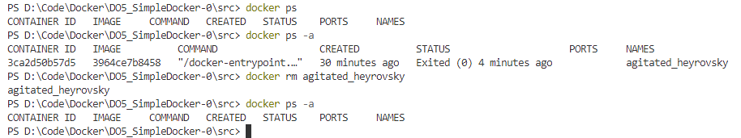

11. Imported the container back using the import command `$ docker import --change "CMD /docker-entrypoint.sh nginx -g 'daemon off;'" container.tar nginx2:latest2`:
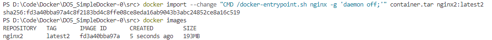

12. Run the imported container `$ docker run -d -p 80:80 fd3a40bba97a`:
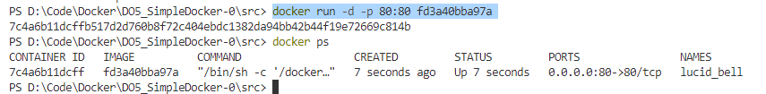

13. Localhost:80/status returns the nginx server status page:
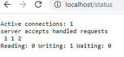

14. The contents of the created nginx.conf file:
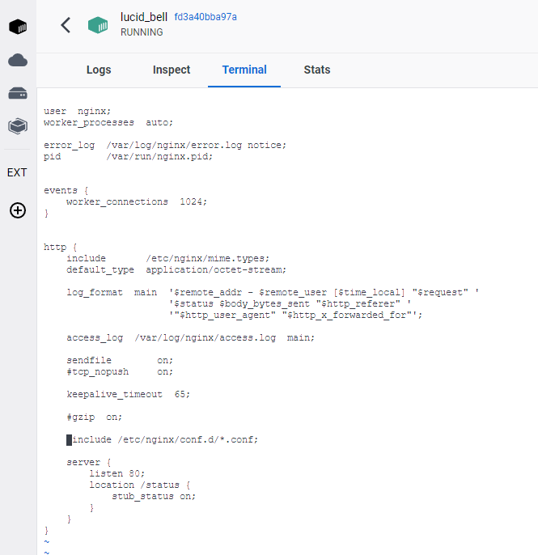

## Part 3. Mini web server:
