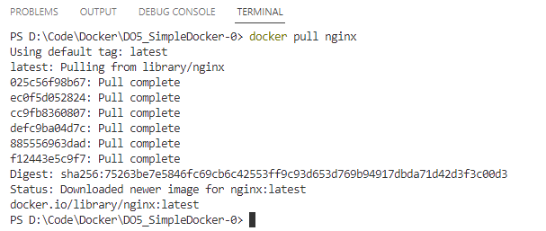
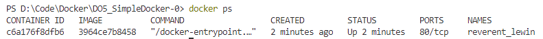
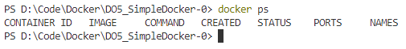
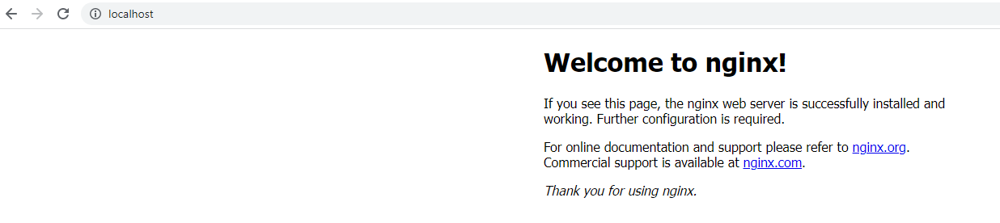
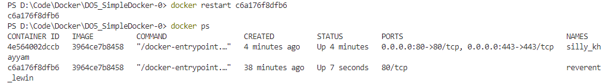

# Docker nginx image report

## Part 1. Ready-made docker

1. Download the official docker image from nginx using `$ docker pull`:

2. Check for the docker image with `$ docker images`:\
`REPOSITORY   TAG       IMAGE ID       CREATED      SIZE`\
`nginx        latest    3964ce7b8458   6 days ago   142MB`

3. Run docker image `$ docker run -d 3964ce7b8458`:\
`c6a176f8dfb6ebd3d011bf22fdd9f53c00e6531461d18d5c75ff62e1b89e1c18`

4. Check that the image is running: `$ docker ps`:

5. View container information `$ docker inspect c6a176f8dfb6`

Container size: `"SizeRootFs": 141843741`\
List of mapped ports: `"Ports": {"80/tcp": null}`\
Container IP: `"IPAddress": "172.17.0.2"`

6. Stop docker image `$ docker stop`: \
`c6a176f8dfb6`

7. Check that the image has stopped `$ docker ps`:

8. Run docker with mapped ports 80 and 443 on the local machine with run command: `$ docker run -d -p 80:80 -p 443:443 3964ce7b8458`:

9. Check that the nginx start page is available in the browser at localhost:80:

10. Restart docker container `$ docker restart c6a176f8dfb6` and check that the container is running:

